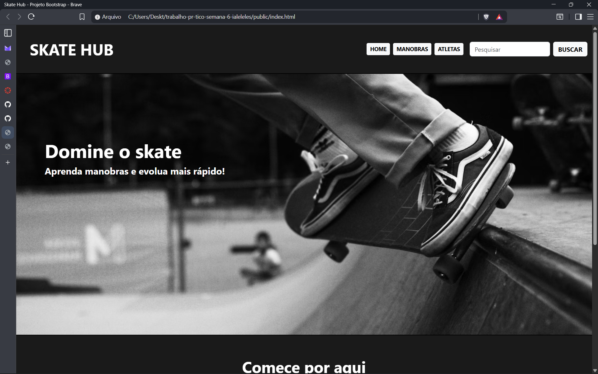
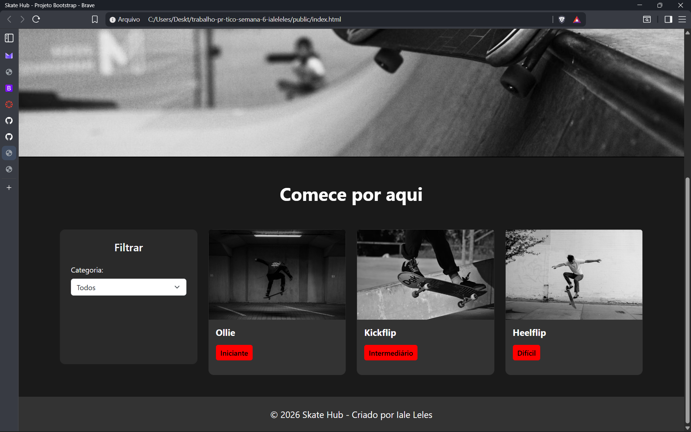

# Trabalho Prático - Semana 6

Nessa atividade, como sempre, vamos evoluir o que foi feito na semana anterior. Fique atento para fazer o projeto da semana anterior e dar sequência nessa jornada.

No trabalho dessa semana vamos alterar o projeto para que a responsividade da home-page seja feita, agora, com o framework Bootstrap.

**IMPORTANTE 1:** Você deve alterar apenas os arquivos **`README.md`**, **`index.html`** e **`styles.css`**, podendo incluir outros arquivos como imagens na pasta **`images`**, caso necessário. Deixe todos os demais arquivos e pastas desse repositório inalterados. **PRESTE MUITA ATENÇÃO NISSO.**

## Informações Gerais

- Nome: Iale Leles de Almeida
- Matricula: 927707
- Proposta de projeto escolhida: Skate Hub - Site para encontrar manobras de acordo com o nível de dificuldade.
- Breve descrição sobre seu projeto: O projeto Skate Hub é um site para fãs de skate que querem aprender manobras de acordo com o seu nível de habilidade. Além disso, o site conta com o filtro de acordo com o nível de dificuldade das manobras, para facilitar os usuários.

## Print da versão responsiva com Bootstrap [DESKTOP]

## Print da versão responsiva com Bootstrap [MOBILE] (*)
1.png)
2.png)
3.png)
4.png)